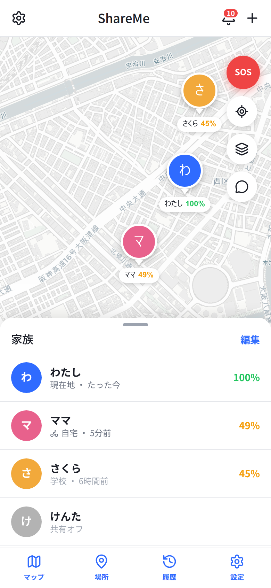
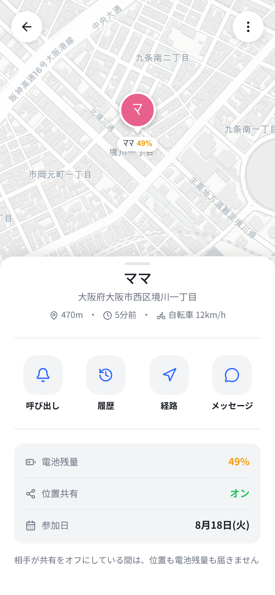
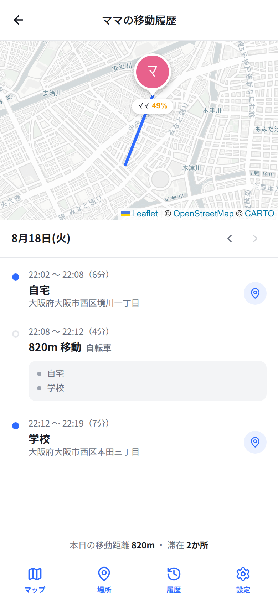
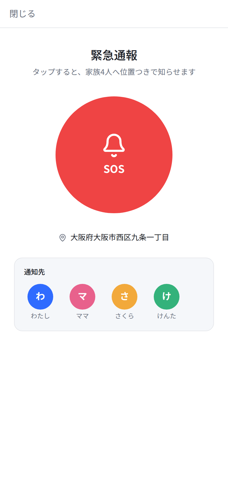

# ShareMe（シェアミー）

家族や友人と位置を共有する Web アプリ。**「見張る」のではなく「見守る」** — 同意の上で、必要なときだけ相手の居場所が分かる、という考え方で作っています。

就職活動用のポートフォリオ作品です。技術的な見どころは **WebSocket（STOMP）によるリアルタイム更新** で、誰かが動くと、家族全員の地図がその場で書き換わります。

<table>
  <tr>
    <td align="center" width="25%">
      <br>
      <sub>マップ（SC-M01）</sub>
    </td>
    <td align="center" width="25%">
      <br>
      <sub>メンバー詳細（SC-M02）</sub>
    </td>
    <td align="center" width="25%">
      <br>
      <sub>位置履歴（SC-M03）</sub>
    </td>
    <td align="center" width="25%">
      <br>
      <sub>緊急通報（SC-S01）</sub>
    </td>
  </tr>
</table>

<sub>他の画面は <a href="docs/screenshots/">docs/screenshots/</a> にあります。</sub>

---

## できること

| | 機能 |
|---|---|
| 位置 | リアルタイム位置共有 / 共有オン・オフ / 位置履歴 / 距離・電池残量 |
| 場所 | 場所の登録（自宅・学校など）と、到着・出発の自動通知（ジオフェンス） |
| 安全 | **SOS** 発信と「向かっています」の応答確認 |
| 連絡 | **呼び出し（Ping）** — 子どもが電話に出ないときに警報音を鳴らす。応答確認つき |
| 会話 | **トーク** — グループチャットと個人チャット |
| 運営 | グループ作成・招待コードでの参加・メンバー管理・通知一覧 |

画面数 17、DBテーブル 14。詳しい仕様は **[docs/01_企画書.md](docs/01_企画書.md)**、デザインの根拠は **[docs/02_デザインガイドライン.md](docs/02_デザインガイドライン.md)** にあります。

---

## 技術構成

**フロントエンド** — React 19 / Vite 8 / JavaScript（TypeScript は使っていません）
`react-router-dom` · Tailwind CSS 4 · zustand · axios · **Leaflet + react-leaflet** · **@stomp/stompjs** · oxlint + Prettier

**バックエンド** — Spring Boot 3.5 / Java 21 / Maven
Spring Security + JWT · Spring WebSocket（STOMP） · Spring Data JPA · **PostgreSQL** · **Flyway**

フロントとバックは完全に分離し、REST API と WebSocket でつないでいます。

---

## 設計で迷って、決めたこと

ポートフォリオとして一番見てほしいのはここです。

### リアルタイムは「配るだけ」に絞った

書き込みは REST、配信だけ WebSocket に任せています。双方向にすると、同じ更新経路が2本できて、どちらが正なのか分からなくなるためです。配信の出口は `RealtimePublisher` 1か所に集約し、各サービスは「何が起きたか」を渡すだけで、どの宛先に流れるかを知りません。

⚠️ ハマった点：`JwtAuthFilter` は WebSocket に届きません（HTTP なのは handshake だけ）。ブラウザは handshake にヘッダーを付けられないので、認証は STOMP の **CONNECT フレーム**で行っています（`StompAuthInterceptor`）。また再接続すると購読はすべて消えるため、`lib/realtime.js` が購読を自前で覚えていて、`onConnect` で貼り直します。

### スキーマは Flyway が管理し、`ddl-auto` は `validate`

`update` にすると列の追加しかできず、削除も型変更もできないまま本番のスキーマが少しずつ壊れていきます。`validate` なら、エンティティとテーブルがずれた時点で起動が止まります。

### 逆ジオコーディングは国土地理院、地図タイルは CARTO

どちらも **APIキー不要・クレジットカード不要・無料**。Google Maps は課金事故の危険があるため見送りました。住所は約100m動いたときだけ引き直し、取れなければ**空のままにします**。それらしい住所をでっち上げると、地図の位置と住所が食い違って原因不明の不具合になります。

### 「車」ではなく「乗り物」と表示する

移動手段は直近2点の平均速度から推定しています。ですが時速60kmの電車と時速60kmの車は同じ数字になり、区別できません。OS の行動認識API（iOS `CMMotionActivity` / Android Activity Recognition）に相当するものがブラウザには無いためです。持っている情報で言えるのは「速い乗り物で移動している」ところまでなので、そこまでしか名乗らないことにしました。

### 作らないと決めたもの

- **`POST /api/auth/logout`** — JWT はサーバーに状態を持たないので、消すべきものがありません。フロントがトークンを捨てれば十分です。
- **相手ごとの位置共有スイッチ** — DB にあるのは「自分がそのグループで共有するか」だけです。モックアップにはスイッチがありましたが、押しても何も起きないので表示だけにしました。作るならまず設計から。

---

## 分かっている制約

Web アプリである以上どうにもならない部分です。隠さず、画面にもそう出しています。

- **バックグラウンドで追跡できません。** タブが開いている間しか位置を取れないので、常に「たった今 / 5分前」と更新時刻を出しています。
- **電池残量は Chrome / Edge のみ。** Firefox と Safari は `navigator.getBattery()` を廃止しました。取れなければ「不明」と出します。
- **位置情報は HTTPS か localhost でのみ動きます**（secure context）。
- **呼び出しの警報音は、アプリを開いていないと鳴りません。** 閉じている間は Web Push の通知音になり、マナーモードは上書きできません。

---

## 動かし方

必要なもの: Java 21 / Maven / PostgreSQL / Node.js

```bash
# 1. DB とユーザーを用意する
#    ⚠️ 既定の接続情報は mimamori / mimamori。ロールも一緒に作ること
sudo -u postgres psql -c "CREATE ROLE mimamori LOGIN PASSWORD 'mimamori';"
sudo -u postgres createdb -O mimamori mimamori
#    テーブルは Flyway が起動時に作るので、ここでは作りません

# 2. バックエンド（http://localhost:8080）
cd api
./mvnw spring-boot:run

# 3. フロントエンド（http://localhost:5173）
cd frontend
npm install
npm run dev
```

`api/src/main/resources/application.properties` の既定値がローカル向けなので、環境変数なしで起動します。接続先を変えるときは `DB_URL` / `DB_USERNAME` / `DB_PASSWORD` を設定してください。

フロントの接続先は `frontend/.env.local` に書きます（見本は `.env.example`）。

### デモ用アカウント

Flyway の `V3__demo_data.sql` が、大阪市西区に住む4人家族を作ります。**パスワードはすべて `mimamori`**。

| メール | 名前 | 状態 |
|---|---|---|
| `watashi@example.com` | わたし | オーナー |
| `mama@example.com` | ママ | 自宅と学校の間を移動中 |
| `sakura@example.com` | さくら | 学校に滞在 |
| `kenta@example.com` | けんた | 位置共有オフ・電池 14% |

`DEMO_MOVEMENT=true` を付けて起動すると、ママが実際に歩き出します。リアルタイム更新を一人で確かめるためのもので、既定では無効です。

```bash
DEMO_MOVEMENT=true ./mvnw spring-boot:run
```

**リアルタイムを確かめるには**、ブラウザを2つ（通常ウィンドウとシークレットウィンドウ）開き、別々のアカウントでログインしてください。片方で SOS を出すと、もう片方が受信画面に切り替わります。

---

## 開発について

```bash
cd frontend && npm run check   # oxlint + Prettier + build
cd api && ./mvnw test
```

⚠️ `npm run build` が通っても動くとは限りません。Vite は構文しか見ないので、変数が存在するかは確認しません。実際に `import` を1つ忘れて画面が真っ白になったことがあります。この構成では oxlint の `no-undef` と `react/jsx-no-undef` が唯一の安全網です。

バックエンドとの接続点は **`frontend/src/api/index.js` 1ファイル**に集約しています。画面から直接 `fetch` は書きません。

---

## まだ手を付けていないところ

- SOS 発信中に位置の送信間隔を5秒へ短縮する（`PING_INTERVAL_SOS` は用意だけ）
- Web Push（テーブルとエンティティはあるが、購読の受け口と送信が無い）
- 通知設定の保存先（画面はあるが、サーバーに持たせていない）
- トークンを `localStorage` に置いている。XSS に弱いが、実装の分かりやすさを優先した
